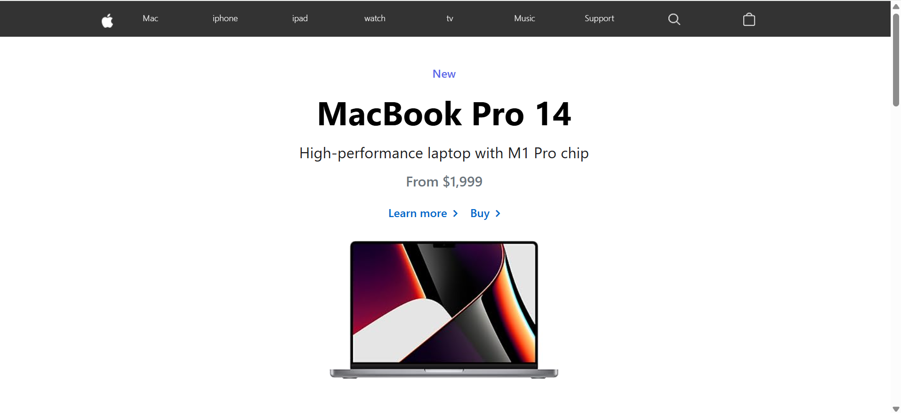
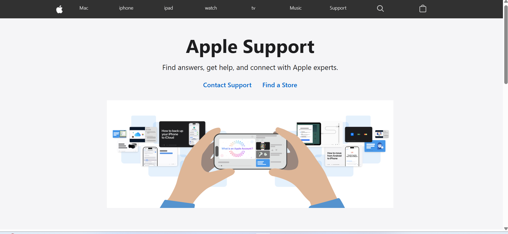
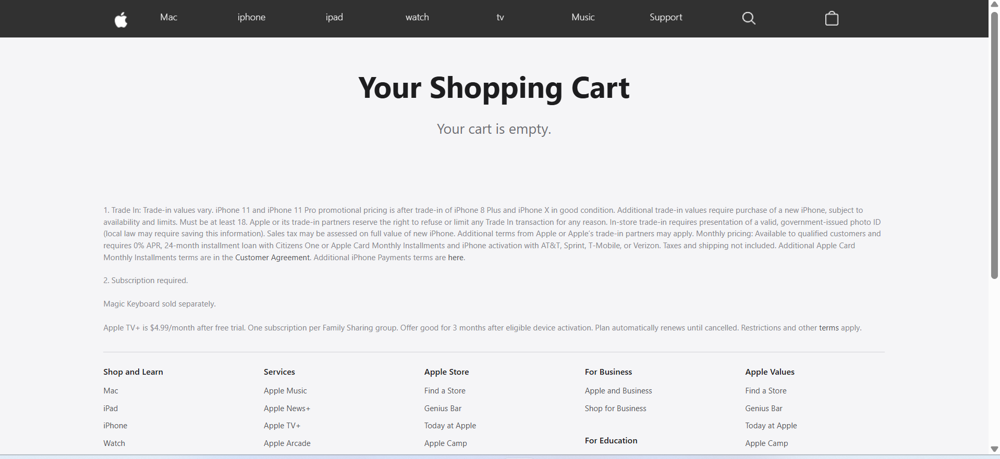

[](https://apple-clone.mikretadesse.com)  
[](https://getbootstrap.com/)  
[](https://github.com/mikretadesse/apple-clone)  


# 🍎 Apple Clone

This project is a **multi-page clone of the Apple website**, built as part of the **Evangadi Fullstack Web Development Bootcamp**.
It was created to practice React, CSS, and Bootstrap, and to reinforce version control with Git and GitHub.

---

## 🚀 Project Overview

The goal of this project is to recreate the complete Apple website layout using **React, CSS, and Bootstrap**, including pages such as:
* **Home Page** - Hero banner, featured products, and promotional sections
* **Products Pages** - MacBook, iPad, iPhone, Apple Watch, and Apple TV
* **Cart Page** – Static layout showing items and total (non-interactive)

Key focuses include:
* Structuring a professional webpage layout
* Styling with CSS for typography, spacing, and alignment
* Practicing responsive design principles
* Using Git commands for project version control

---

## 🛠️ Technologies Used

* **React**
* **HTML5 & CSS3**
* **Bootstrap**
* **Git & GitHub**

---

## 🌐 Live Demo

> Live demo available here:
> 
> **https://apple-clone.mikretadesse.com** 

---

## 📂 How to Run

1. Clone the repository

   ```bash
   git clone https://github.com/mikretadesse/apple-clone.git
   ```
2. Open the folder

   ```bash
   cd client
   ```
3. Run the project
     ```bash
   npm install
   ```
4. Start the development server:
   ```bash
   npm run dev
   ```

## 📸 Screenshots

  
  
  
  


## 👩🏽‍💻 Author

Developed by **Mikre Tadesse** as part of the **Evangadi Fullstack Bootcamp**.
This project is for **educational and practice purposes only**.


## ⚠️ Copyright Disclaimer

This project is **not affiliated with or endorsed by Apple Inc.**
All logos, product images, and trademarks used here belong to **Apple Inc.**
The design is recreated **solely for learning and portfolio demonstration**.

-